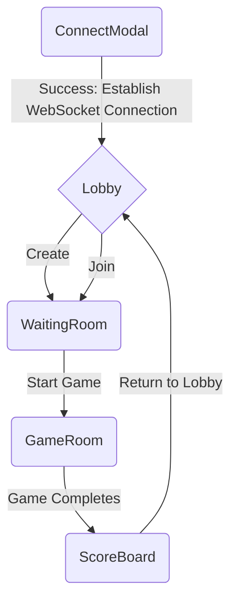

# Thinking Aloud

## Overview
The purpose of this file is to share some of the thoughts and decisions made during the development of this project, both technical and approach-wise.

## Decisions and Thought Process
### Application Structure & State Management

> **Note:** Consider using a Markdown preview extension for a better view of the chart below.
> - **VS Code:** Suggestion: "Markdown Preview Enhanced" extension.
> - **GitHub:** GitHub's Markdown renderer to view the chart directly in .md files.

#### Single Page Application (SPA):
The application is designed with a relatively linear flow in mind. With the limited need for complex navigation or distinct pages, the project is developed as a SPA to minimize complexity and provide for a smooth user experience compared to multi-page navigation and to avoid page refresh.

**Considerations:**
- **Pros:**
  - More flexibility and fine-grained control over when and how components are rendered based on state changes.
  - Keeping away from full page refresh to maintain web socket connection.

- **Cons:**
  - Developed without React Router so I needed to manually manage the rendering of components based on state changes and user’s interactions. This gave me more detailed control but also had to incorporate more error handling to handle edge cases. 

#### State Management:
Considering the size of the application and the relatively straightforward data flow, I focused on maintaining simplicity of the application and decided to use prop drilling rather than centralized state management solutions.

**Considerations:**
- **Pros:**
  - Reduces boilerplate and keeps component interactions predictable.
  - Easy to trace data flow through components to help with maintainability and detecting errors in the application. 

- **Cons:**
  - As the application scales and to add more features, refactoring might be necessary to streamline prop drilling or there might be a need to transition to centralized state management
 
### Implementing WebSocket:
I researched into the different libraries and chose WS over Socket.io. The latter seems to be a higher-level library and provided more functionalities but was too robust for what I needed to accomplish. I decided to use WS for its lightweight nature and ease of integration. My approach to implementing WebSocket involved focusing on handling real-time updates, managing events, planning for edge cases, and setting up auto-reconnection to start a new game for a fluid experience.

**Considerations:**
- **Initial Connection:**
  - To allow for a linear stream of data flow from the server to the components and allow for prompt UI updates based on returning events, the connection is initialized at the start of the application through users submission of a username to connect to the server. 

- **Handling Real-Time Updates:**
  - Through listening to the “type” property of the WebSocket events, the corresponding states and UI components are triggered for update to reflect real-time changes. 
 
- **Handling Reconnection:**
  - A challenge I encountered was when users attempt to submit answers for the second or third game, the WebSocket connection will be disconnected, causing inconvenience for users and other players that might be in the same game. To set up for a fluid and user-friendly experience, the design of the frontend structure currently sets up users to reconnect at the end of every game so that they can start a new game with the newly established connection. This has helped to ensure that users can play multiple games consecutively without getting disconnected again.
  - However, due to the setup that a non-duplicate "name" value is needed to connect to the server again everytime, I setup for a random string to be generated and automatically appended at the end of the users original "name" input to establish a new connection. This random string serves to represent as the "session id" for users. 
    
- **Handling Edge Cases:**
  - While concatenating a random string value to the end of the users original "name" input helped to reconnect users automatically and ensures that they can play multiple games consecutively, it also brought upon some other challenges, such as requiring extra arrangements to ensure that the users are only seeing the username they have inputted instead of with the random string. Also because multiple users will be able to input the same "name", I've structured it so that other users with the same name as the current user will have their username displayed with the trailing session id. This helps the current user to differentiate themselves from other users who shares the same "username". 
  - When multiple events are sent to the server at a short time, it causes WebSocket to disconnect. To address this, I implemented frontend logic to disable the event triggers / buttons after it has been called to prevent users from triggering the same event repeatedly.
 
    
### UI / UX Design :
I decided to go with a fun retro gaming theme and styled the application with SCSS for easy maintainability by leveraging its nesting feature of the styling classes and using reusable variables to define global values like colors and fonts. 

**Feedback Mechanism:**
- Aiming to provide a smooth and responsive user experience, I focused on building a clean interface aligned with the retro gaming theme and added simple animation to transition with loading messages. When selecting answers in the game, users will be prompted with messages or UI signals to let them know their action is registered. This serves as a feedback for users to make the experience more intuitive and ensure smooth transitioning.
  
**Effortless Navigation:**
- I planned with the approach to reduce the number of steps required to bring users to create, join, and start a game by handling the required user’s input early in the application, passing it down to other components, and clearing previous game data. This helped to optimize interactions and minimize the need for repetitive user input whenever possible.

## Wrap-up

My overall approach was to build for a maintainable and user-friendly application, where I evaluated the trade-offs and considered how it would impact the development process and the user's experience as a whole. 

**Future Considerations:**
- **Scalability:** As the application grows, might need to revisit the state management strategy. While the current prop drilling approach is effective and manageable for the current requirements, as more features are added and user interactions increase, state management can become more complex and we might need to explore other solutions like React Context API or Redux. 
- **Feature Extensions:** Potential future enhancements include advanced routing, authentication, and user management, which should align with the current application structure.

